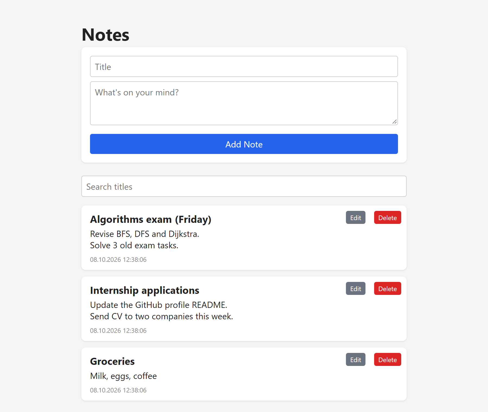

# Notable

[](https://github.com/ardapkr/notable_django/actions/workflows/ci.yml)

A small notes app: a Django REST API (built with [django-tastypie](https://django-tastypie.readthedocs.io/))
and a single-page frontend in plain JavaScript. I built it to learn how a REST API, a database model and a
frontend fit together in Django.



## Features

- Create, list, edit, delete and search notes through a REST API
- Input validation on the server: a title is required and at most 200 characters (the API answers `400` with the reason)
- Newest notes first, search by title (`?title__icontains=`)
- Frontend in plain HTML/CSS/JS (`fetch`, no framework); note text is rendered with `textContent`, so it can't inject HTML
- Django admin for browsing notes
- 14 API tests, run on every push with GitHub Actions

## Tech stack

Python · Django 6 · django-tastypie · SQLite · vanilla JavaScript · GitHub Actions

## Run it

```bash
git clone https://github.com/ardapkr/notable_django.git
cd notable_django
python -m venv .venv
.venv/Scripts/activate        # Windows (macOS/Linux: source .venv/bin/activate)
pip install -r requirements.txt
python manage.py migrate
python manage.py runserver
```

Open <http://localhost:8000/>. A local secret key is generated on the first run (stored in `.django_secret_key`,
git-ignored).

## Tests

```bash
python manage.py test
```

The tests in [`api/tests.py`](api/tests.py) use Django's test client against a temporary database and cover
create, read, update, delete, validation errors, ordering and search.

## API

| Method | URL | Description |
|--------|-----|-------------|
| GET    | `/api/note/` | List notes, newest first (`?title__icontains=java` to search) |
| POST   | `/api/note/` | Create a note, returns the saved note |
| GET    | `/api/note/<id>/` | Get one note |
| PUT    | `/api/note/<id>/` | Update a note |
| DELETE | `/api/note/<id>/` | Delete a note |

```bash
curl -X POST http://localhost:8000/api/note/ \
  -H "Content-Type: application/json" \
  -d '{"title": "My note", "body": "Some content"}'
```

A note without a title is rejected:

```json
{"note": {"title": "Title is required."}}
```

## Project layout

```
api/
  models.py      Note model (title, body, created_at, updated_at)
  resources.py   REST resource: fields, validation, filtering, ordering
  tests.py       API tests
  templates/index.html   the whole frontend
notable_django/
  settings.py    reads DJANGO_SECRET_KEY, DJANGO_DEBUG, DJANGO_ALLOWED_HOSTS, DJANGO_DB_PATH from the environment
  urls.py        /admin/, /api/, and the index page
```

## Configuration

| Variable | Default | Meaning |
|---|---|---|
| `DJANGO_SECRET_KEY` | generated file | secret key for a real deployment |
| `DJANGO_DEBUG` | `1` | set to `0` outside local development |
| `DJANGO_ALLOWED_HOSTS` | empty | comma-separated host names |
| `DJANGO_DB_PATH` | `db.sqlite3` | path of the SQLite file |

## Next steps

- Add user accounts so each person only sees their own notes (the API is open right now, which is fine locally but not for a shared server)
- Markdown rendering for note bodies
- Deploy with PostgreSQL

## License

MIT
